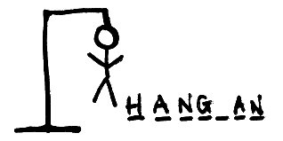

# Hangman Game

    

Welcome to the Hangman Game, this is my first real project in Python.

# Terminal Display

Representation of images of the game running in the terminal

#### Start game

    *********************************
    ***Welcome to the Hangman Game***
    ******Discover the last name*****
    *********************************
    
    The secret word contains 6 chars
    
    ['_', '_', '_', '_', '_', '_']
    
                _______
                |     |
                |   
                |   
                |   
                |
                
    You have 6 life 
    
    Enter with a new char
    _

#### Win game

    Enter with a new char
    n
    ['e', 'a', 't', 'o', 'n']
    
            _______
            |     |
            |     O
            |    /|\
            |    / 
            |
            
    You have 1 life 
    
    You WIN the game: Eaton

#### Lost Game

    Enter with a new char
    i
    ['b', 'e', '_', 'd', 'e', '_']
    
                _______
                |     |
                |     O
                |    /|\
                |    / \
                |  ((dead))
                
    You have 0 life 

    You LOST, the word is: Bender
    
# How to run the Hangman Game

The following steps have been documented to be executed on a 
Linux platform, but the commands with the Windows system may 
be similar, but the operation is not fully guaranteed.

- Clone the repository

        $ git clone https://github.com/gbzarelli/hangman-python
    
- Access the folder
        
        $ cd ./hangman-python
        
- Install game

        $ make install

- Run unit tests:

        $ make test_unit

- Run the game

        $ make start
        
# Developer

**Guilherme Biff Zarelli**
- Blog/Site - https://helpdev.com.br
- LinkedIn - https://linkedin.com/in/gbzarelli/
- GitHub - https://github.com/gbzarelli
- Email - gbzarelli@helpdev.com.br